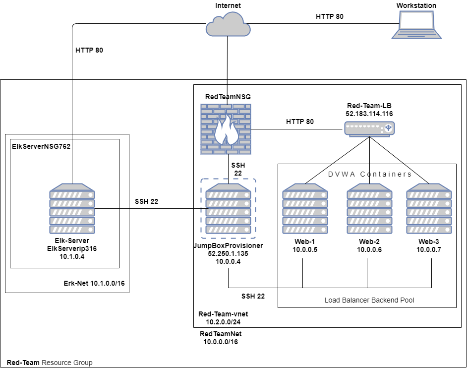

# Automated ELK Stack Deployment
The files in this repository were used to configure the network depicted below.

These files have been tested and used to generate a live ELK deployment on Azure. They can be used to either recreate the entire deployment pictured above. Alternatively, select portions of the file may be used to install only certain pieces of it, such as Filebeat.

  - [DVWA Webserver Playbook](Ansible/roles/dvwa-playbook.yml)
  - [ELK Stack Playbook](Ansible/roles/elk-stack-playbook.yml)
  - [Filebeat Playbook](Ansible/roles/filebeat-playbook.yml)
  - [Metricbeat Playbook](Ansible/roles/metricbeat-playbook.yml)

This document contains the following details:
- Description of the Topology
- Access Policies
- ELK Configuration
  - Beats in Use
  - Machines Being Monitored
- How to Use the Ansible Playbooks


### Description of the Topology

The main purpose of this network is to expose a load-balanced and monitored instance of DVWA, the D*mn Vulnerable Web Application.

Load balancing ensures that the application will be highly available, in addition to restricting access to the network.

Integrating an ELK server allows users to easily monitor the vulnerable VMs for changes to the log files and system metrics.

The configuration details of each machine may be found below.

| Name                 | Function           | Private IP Address | Public IP Address | Operating System |
|----------------------|--------------------|--------------------|-------------------|------------------|
| Jump-Box-Provisioner | Gateway            | 10.0.0.4           | 168.62.21.152     | Ubuntu LTS 18.04 |
| Web-1                | Application Server | 10.0.0.5           | N/A               | Ubuntu LTS 18.04 |
| Web-2                | Application Server | 10.0.0.6           | N/A               | Ubuntu LTS 18.04 |
| Web-3                | Application Server | 10.0.0.7           | N/A               | Ubuntu LTS 18.04 |
| elk-stack            | ELK Stack          | 10.1.0.4           | 23.96.81.242      | Ubuntu LTS 18.04 |

### Access Policies

The machines on the internal network are not exposed to the public Internet. 

Only the Jump-Box-Provisioner and ELK Stack (Kibana) machines can accept connections from the Internet. Access to this machine is only allowed from the following IP addresses:
- My Home IP Address

Machines within the network can only be accessed by Jump-Box-Provisioner.

A summary of the access policies in place can be found in the table below.

| Name                 | Publicly Accessible | Allowed IP Addresses |
|----------------------|---------------------|----------------------|
| Jump-Box-Provisioner | Yes                 | My Home IP Addr      |
| elk-stack            | Yes                 | My Home IP Addr      |
| Web-1                | No                  | 10.0.0.4             |
| Web-2                | No                  | 10.0.0.4             |
| Web-3                | No                  | 10.0.0.4             |


### Elk Configuration

Ansible was used to automate configuration of the ELK machine. No configuration was performed manually, which is advantageous 
because it allows a consistent and predictable configuration. In addition to consistency, with an automated setup, the ELK stack
can be created and configured very quickly.  

The playbook implements the following tasks:
- Configure maximum mapped memory with `sysctl` module
- Install `docker.io` and `python3-pip` packages with `apt` module
- Install docker `python` package with `pip`
- Enable systemd docker service
- Run ELK docker container


The following screenshot displays the result of running `docker ps -a` after successfully configuring the ELK instance.


#### Target Machines & Beats
This ELK server is configured to monitor the following machines:
- Web-1: 10.0.0.5
- Web-2: 10.0.0.6
- Web-3: 10.0.0.7

We have installed the following Beats on these machines:
- Filebeat
- Metricbeat

These Beats allow us to collect the following information from each machine:
- Filebeat parses and forwards system logs from the Web VMs to the ELK Stack in an easy to read format.
- Metricbeat reports system and service statistics about the Web VMs to the ELK stack VM.

### Using the ELK Stack Playbook
In order to use the playbook, you will need to have an Ansible control node already configured. Assuming you have such a control node provisioned: 

SSH into the control node and follow the steps below:

- Copy the `elk-stack-playbook.yml` playbook file to `/etc/ansible/roles/`
    directory inside the ansible container.
    - `$ sudo docker cp elk-stack-playbook.yml <container.name>:/etc/ansible/roles/elk-stack-playbook.yml`

- **Optional:** Copy the whole directory for the Metricbeat and Filebeat
        playbooks and configuration files.
    - `$ sudo docker cp Ansible/* <container.name>:/etc/ansible`

- Attach to the ansible docker with `$ sudo docker attach <container.name>`

- Update the [/etc/ansible/hosts](Ansible/hosts) file to include the ELK stack VM IP address.
  - Append `ansible_python_interpreter=/usr/bin/python3` to ensure that the
      correct version of python is used.

    - Example configuration of `/etc/ansible/hosts`
```bash
[elk]
<internal.ip>      ansible_python_interpreter=/usr/bin/python3
<external.ip>      ansible_python_interpreter=/usr/bin/python3
alpha.example.org  ansible_python_interpreter=/usr/bin/python3
```
- Run the playbook, and navigate to `http://[your.elk.ip]:5601/app/kibana.` to check that the installation worked as expected.

    - `$ ansible-playbook /etc/ansible/roles/elk-stack-playbook.yml`


### Using the Metricbeat and Filebeat Playbooks

#### Filebeat 

- Edit [/etc/ansible/files/filebeat-config.yml](Ansible/files/filebeat-config.yml) in the ansible container on the control node to include the ELK Stack IP address. You should also change the default login credentials.

```yml
output.elasticsearch:
hosts: ["<elk.ip.addr>:9200"]
username: "elastic"
password: "changeme"
```
```yml
setup.kibana:
host: "<elk.ip.addr>:5601"
```

- Then run the playbook 
  - `$ ansible-playbook /etc/ansible/roles/filebeat-playbook.yml`


#### Metricbeat

- Edit [/etc/ansible/files/metricbeat-config.yml](Ansible/files/metricbeat-config.yml) in the ansible on the control node to include the ELK Stack IP address. You should also change the default login credentials.

```yml
output.elasticsearch:
hosts: ["<elk.ip.addr>:9200"]
username: "elastic"
password: "changeme"
```
```yml
setup.kibana:
host: "<elk.ip.addr>:5601"
```
		
- Then run the playbook 
  - `$ ansible-playbook /etc/ansible/roles/metricbeat-playbook.yml`
